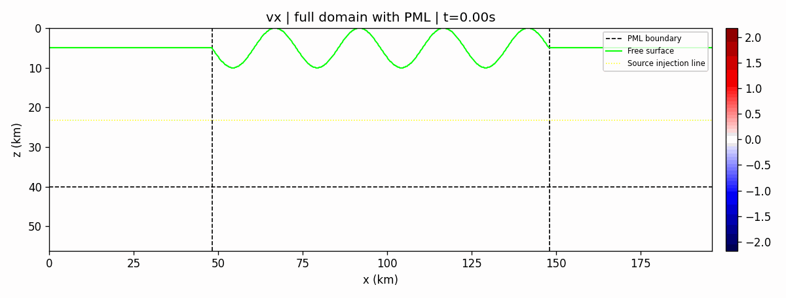
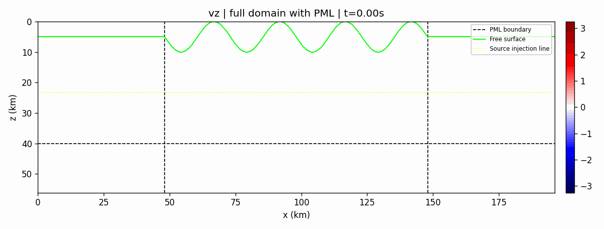
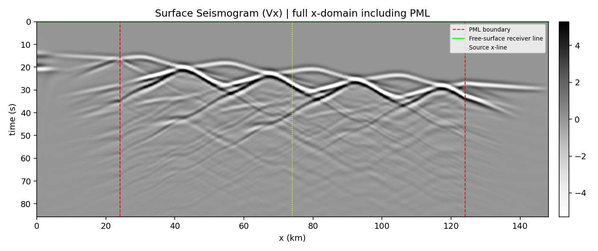
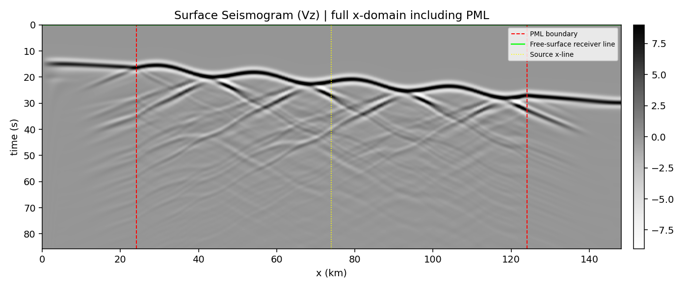

# telefd2d

`telefd2d` is a 2D staggered-grid elastic finite-difference (FD) forward-modeling workflow with rugged free-surface topography, absorbing boundaries, and decoupled compute/postprocess stages.

`telefd2d` 是一个支持起伏自由表面的二维交错网格弹性波有限差分正演流程，包含吸收边界，并采用计算与后处理解耦的工作流。

## Topography Demo / 地形算例展示

### Wavefield Vx (GIF)


### Wavefield Vz (GIF)


### Surface Seismogram Vx


### Surface Seismogram Vz


## Features / 特性
- Rugged top free surface, absorbing left/right/bottom boundaries.
- Plane-wave incidence from lower-left (`20 deg` from z-axis).
- Ricker wavelet source (default `0.25 Hz`).
- Optional C++/OpenMP accelerated backend.
- Streaming output mode to reduce memory pressure.
- Decoupled workflow (`compute` then `postprocess`).

## Repository Layout / 目录结构
- `src/fd_workflow/`: core simulation and postprocess modules.
- `scripts/build_fd_boost.py`: build C++ extension.
- `scripts/run_acceptance_case.py`: main acceptance workflow entry.
- `scripts/benchmark_speed_consistency.py`: speed + consistency benchmark.
- `scripts/benchmark_streaming.py`: memory/streaming benchmark.
- `prompts/`: `/init` and main CLI prompt package.
- `docs/workflow_plan.md`: AC-driven execution evidence.
- `output/forward_case_telefd2d/`: generated acceptance artifacts.
- `assets/topo_demo/`: README-visible demo assets.

## Quick Start / 快速开始

### 1) Install dependencies / 安装依赖
```powershell
python -m pip install -r requirements.txt
```

### 2) Build extension (optional but recommended) / 编译加速扩展（推荐）
```powershell
python scripts/build_fd_boost.py
```

### 3) Run acceptance case / 运行验收算例
```powershell
python scripts/run_acceptance_case.py --mode all --backend boost_parallel --threads 14 --output-mode stream_to_disk --output-subdir forward_case_telefd2d --progress-step 200 --progress-sec 0.5
```

### 4) Locate outputs / 查看输出
Under `output/forward_case_telefd2d/`:
- `wavefield_vx.gif`, `wavefield_vz.gif`
- `wavefield_p.gif`, `wavefield_curl.gif`
- `surface_seismogram_vx.png`, `surface_seismogram_vz.png`
- `compute_metadata.json`, `run_metadata.json`, `run_summary.txt`

## Optional Benchmarks / 可选基准测试

### Streaming memory benchmark
```powershell
python scripts/benchmark_streaming.py
```

### Speed + consistency benchmark
```powershell
python scripts/benchmark_speed_consistency.py --baseline-subdir forward_case_telefd2d
```

## Publish Checklist / 发布检查
- [x] Bilingual README.
- [x] Topography demo media visible at intro.
- [x] Plan-first execution evidence in `docs/workflow_plan.md`.
- [x] Two-stage prompts in `prompts/`.

## License
License is not set yet. Add `LICENSE` before public release if needed.
